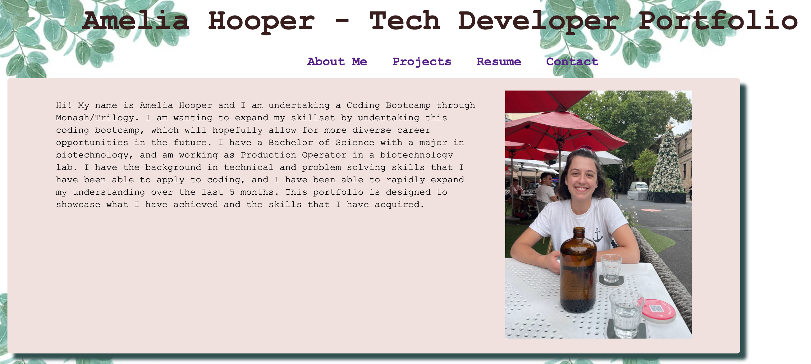

# REACT - Portfolio
## Desciption 
This project uses react to create a frontend portfolio. This portfolio showcases some of the projects that I have completed during this bootcamp, and will continue to be updated with new projects that I complete, and new skills that I acquire. 
## Table of Contents
* [Installation](#Installation)
* [Usage](#Usage)
* [Contributing](#Contributing)
* [Application](#Application)
* [Questions](#Questions)
## Installation
If you wish to set up for this project from the command line, use npm i to install dependencies. This is required in both the client and server folders.
```
npm i
```
## Usage
Once installation of dependencies is complete, you will need to run 'npm run start' in the terminal, and the application will open using localhost:3000
```
npm run start
```
Alternatively, this application is deployed to GitHub Pages, which makes it easy to simply view the project in the browser.
## Contributing
To contribute to the project, simply perform a git clone of the repository. For any changes made, a pull request is required, and I will determine whether to merge the changes or not.
## Application
- GitHub Pages: [Deployed-application](https://myusername.github.io/react-portfolio)
- GitHub repo: [React-portfolio](https://github.com/ahooper00/react-portfolio)


# Questions
- ahooper00@github.com
- ajhooper97@gmail.com